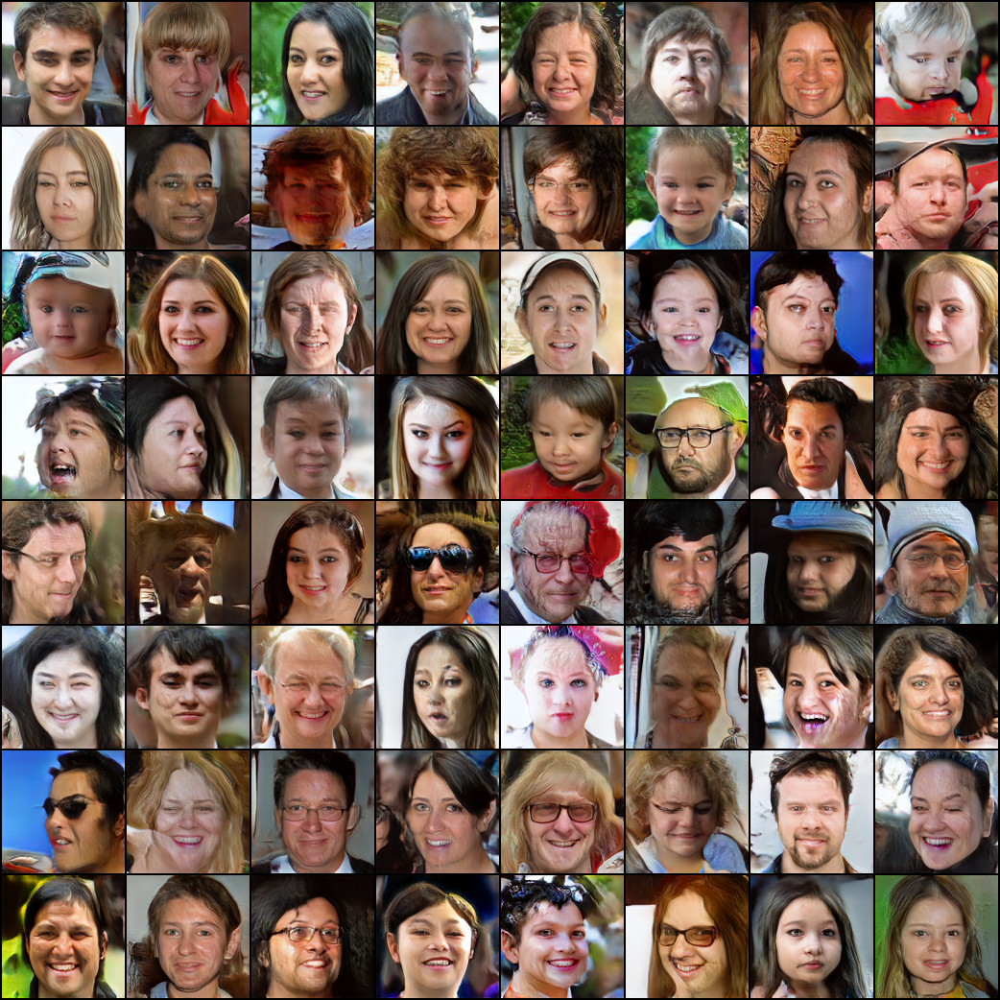

# Mini-ProGAN-pytorch

Quiet Simple ProGAN implementation with pytorch.

## Updates

64x64 training results (On FFHQ Dataset)

Flaws: (1) **Wired artifacts or strokes around faces and background**. Things term to be really bad around the edges of faces.

The WGANLoss in training with 64x64 images is not as stable as that in training with lower resolution, might need more training images with higher resolution (I just showed 300k images in this training setting.)

Next step: try to increse number of showed images and check the codes and trained models completely.

## Plans

- [ ] Code cleaning.
- [ ] Training results with larger resolution.
- [ ] Pre-trained Model.
- [ ] Adaptive and simple module for training GAN progressively.
- [ ] Info-ProGAN.

## References

- Karras, T., Aila, T., Laine, S., & Lehtinen, J. (2018). Progressive growing of GANs for improved quality, stability, and variation. 6th International Conference on Learning Representations, ICLR 2018.
- ProGAN [Officical Implementation](https://github.com/tkarras/progressive_growing_of_gans). 
- [Another awesome implementation with pytorch](https://github.com/akanimax/pro_gan_pytorch/tree/master/pro_gan_pytorch). 
- [FFHQ Dataset](https://github.com/NVlabs/ffhq-dataset)
