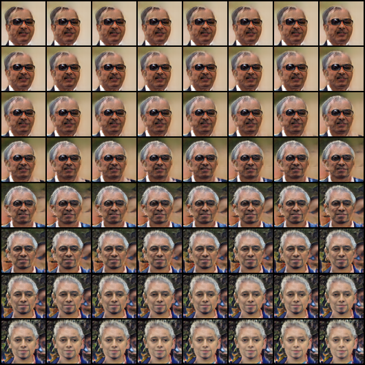

# Mini-ProGAN-pytorch

Quiet Simple ProGAN implementation with pytorch.

## Updates

64x64 training results (On FFHQ Dataset)

| random samples | interpolation in latent space |
| -- | -- |
|  |  |

Lastest results trained with 600k images in one phase.

After fix some bugs about optimizer, generated images get better but still behave bad sometimes in terms of background synthesis and some details (faces always look better if the background is simple or dark). Increasing the batch size, simply showing more images or training the model to higher resolution would help.

## Plans

- [ ] Code cleaning.
- [ ] Training results with larger resolution.
- [ ] Pre-trained Model.
- [ ] Adaptive and simple module for training GAN progressively.
- [ ] Info-ProGAN.

## References

- Karras, T., Aila, T., Laine, S., & Lehtinen, J. (2018). Progressive growing of GANs for improved quality, stability, and variation. 6th International Conference on Learning Representations, ICLR 2018.
- ProGAN [Officical Implementation](https://github.com/tkarras/progressive_growing_of_gans). 
- [Another awesome implementation with pytorch](https://github.com/akanimax/pro_gan_pytorch/tree/master/pro_gan_pytorch). 
- [FFHQ Dataset](https://github.com/NVlabs/ffhq-dataset)
